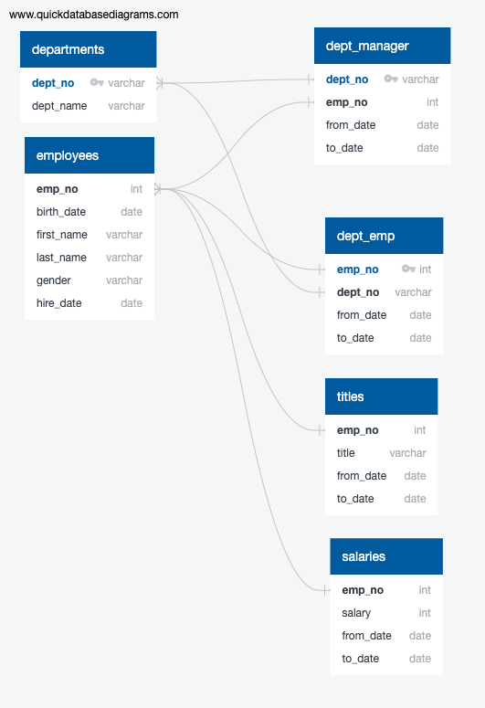
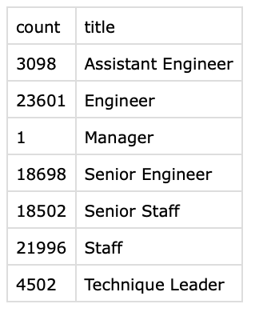
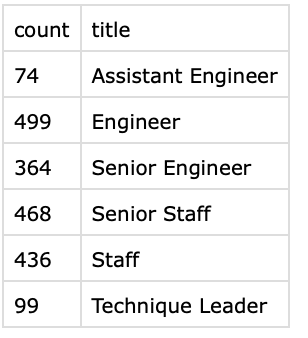

# pewlett-hackard-analysis

### resources:

data: departments.csv, dept_emp.csv, employees.csv, salaries.csv, dept_manager.csv, titles.csv

software: postgresql, pgadmin 4, visual studio code

### Description of Problem 
Employment information was analyzed to discover how many employees could be entering retirement age in the near future. Of the 300,024 employees working for Pewlett-Hackard it was discovered that 90,398 were born between 1952 and 1955. That is 30.13% of the total workforce at pewlett-hackard. This data is broken down into number of employees retiring and their title. The csv file that shows this data is title_totals.csv. In addition to discovering the number of employees that will be eligible to retire we also discovered the number of employees that can replace them by entering a mentorship program. 
### employeeDB schema

### Problem Breakdown
In order to solve the problems outlined above, the data was group into various tables using postgresql and pgadmin. The first tables created are outlined in the EmployeeDB.png file. This file shows the relationship between various tables and how keys were used to join tables. After organizing the data by employee number, first name, last name, salary, and title we only included people born between 1952 and 1955. Over the years workers titles changed as they received promotions or demotions. These duplicates were removed using a partition function. This same approach was applied to the mentor program as well. The only thing changed were the dates because we were not looking for retirement aged employees.

### titles and retirees

### titles and mentors

### Take Away Analysis
With 30% of its workforce near retirement age pewlett-hackard needs to rapidly begin hiring new employees, or restructure so that not as many employees are need to run the company. The mentor program will play a crucial role in the coming years as employees begin to retire and new employees are hired. This program could help new employees get up to speed on the company and their specific role more quickly resulting in less down time for the company. More insights could be gleaned from the data provided for analysis. We did not delve into employee salaries or managerial positions. The number of managers seemed remarkably low considering how many total employees work at pewlett-hackard. 
